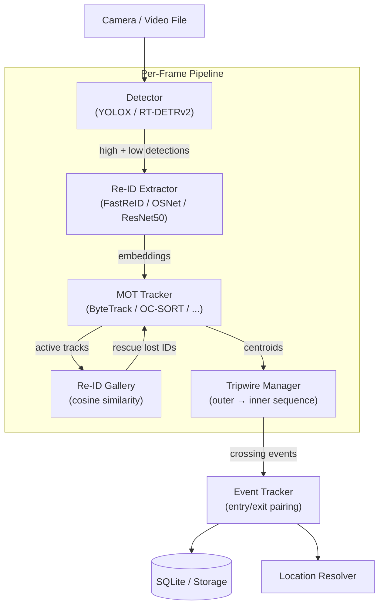

# MOT Tracker Bench

<p align="center">
  
  
  
  
  
</p>

<p align="center">
  Plug-and-play benchmark framework for pedestrian multi-object tracking.<br>
  16 MOT algorithms × 37 Re-ID configurations, all switchable via a single YAML parameter.
</p>

---

## Demo

<p align="center">
  
</p>

<p align="center">
  ByteTrack + YOLOX-S · 4K source · all persons pixelated (mosaic) for privacy<br>
  Source footage: <a href="https://www.pexels.com/ja-jp/video/36926122/">Pexels #36926122</a> (Pexels License)
</p>

The system detects and tracks every pedestrian in view, assigns persistent IDs across frames, and recovers lost identities via Re-ID gallery matching even after full occlusion.

---

## Key Features

- **16 MOT algorithms** switchable at runtime via a single YAML parameter
- **37 Re-ID model configurations** — cascade fallback from FastReID ONNX → OSNet → ResNet50
- **Two detectors** — YOLOX (speed) and RT-DETRv2 (accuracy), interchangeable API
- **Re-ID Rescue** — lost tracks matched against an embedding gallery; IDs survive full occlusion
- **Virtual tripwire** — normalized line-crossing detection for counting pedestrians at any zone boundary
- **Edge-first design** — runs on Jetson Xavier/Orin; GPIO-based lifecycle management
- **Privacy blur script** — mosaic pixelation of all detected persons for demo/public use

---

## Architecture



---

## Benchmark Results

Evaluation: YOLOX-S detector · 300-frame test clip (4K/1440p) · CPU inference

| Tracker + Re-ID | Frags ↓ | Avg Life ↑ | Re-ID Rescue ↑ | Time (s) |
|---|---|---|---|---|
| **OC-SORT + OSNet** | **58** | **44.0** | 35 | 118.5 |
| ByteTrack + OSNet | 60 | 43.8 | 34 | 167.3 |
| ByteTrack + ResNet50 | 60 | 43.8 | 34 | 161.6 |
| StrongSORT + OSNet | 73 | 38.9 | 33 | 119.0 |
| DeepSORT + OSNet | 74 | 38.4 | 34 | 121.0 |
| BoTSORT + OSNet | 116 | 26.1 | **75** | 129.2 |
| FairMOT + OSNet | 120 | 18.9 | 43 | 119.9 |

> **Recommendation**: OC-SORT + OSNet for production (lowest fragmentation + fast inference).  
> BoTSORT if Re-ID rescue rate is the primary metric.

Full evaluation report: [tracking_evaluation_report.md](tracking_evaluation_report.md)

---

## Supported Algorithms

### MOT Trackers (16 implementations)

| Tracker | Core Algorithm | Strength |
|---|---|---|
| **SORT** | Kalman filter + IoU | Lightweight baseline |
| **DeepSORT** | SORT + Re-ID cosine + Mahalanobis gating | Long-gap ID recovery |
| **ByteTrack** | Two-stage matching (high/low confidence) | Occlusion robustness |
| **OC-SORT** | ByteTrack + OCM/OCR momentum | Dense crowd stability |
| **BoTSORT** | ByteTrack + GMC camera compensation + Re-ID | Moving camera / high rescue |
| **StrongSORT** | NSA Kalman + EMA feature smoothing | Noise-resilient tracking |
| **HybridSORT** | Hybrid IoU-appearance cost fusion | Balanced tradeoff |
| **DeepOCSORT** | OC-SORT + deep appearance features | OC-SORT + Re-ID combined |
| **GHOST** | Ghost-track suppression | False positive reduction |
| **SMILE-Track** | Spatial-temporal matching | Graph-based association |
| **SparseTrack** | Sparse appearance + motion | Memory-efficient |
| **CBIoU** | Centered BIoU appearance fusion | Geometry-aware matching |
| **UCMCTrack** | Uncertainty-aware collaborative matching | Confidence-weighted cost |
| **TransTrack** | Transformer-based detection-track binding | Attention association |
| **FairMOT** | Weighted Re-ID + IoU (simplified) | Single-stage simplicity |
| **SORT (GMC)** | SORT + Global Motion Compensation | Camera motion robustness |

### Re-ID Backends (cascade fallback)

```
FastReID ONNX (TensorRT)  ← fastest, production
       ↓ (if unavailable)
FastReID PyTorch           ← development / training
       ↓ (if unavailable)
OSNet x0.25 (torchreid)   ← 512-dim, real-time
       ↓ (if unavailable)
ResNet50 (torchvision)    ← always available, no extra deps
```

---

## Installation

**Prerequisites**: Python 3.10+, pip

```bash
git clone https://github.com/ryosuke-404/mot-tracker-bench.git
cd mot-tracker-bench
python -m venv .venv
source .venv/bin/activate          # Windows: .venv\Scripts\activate

pip install torch torchvision --index-url https://download.pytorch.org/whl/cpu
pip install transformers opencv-python scipy pyyaml torchreid
```

<details>
<summary>GPU / Jetson (CUDA)</summary>

```bash
pip install torch torchvision --index-url https://download.pytorch.org/whl/cu121
pip install onnxruntime-gpu        # for FastReID ONNX + TensorRT
```

For Jetson, install PyTorch from the official [Jetson Zoo](https://forums.developer.nvidia.com/t/pytorch-for-jetson/72048) wheel.
</details>

---

## Quick Start

### Process a video file

```bash
python scripts/run_video.py \
    --video  assets/demo.mp4 \
    --out    outputs/result.mp4 \
    --detector yolox \
    --yolox-model yolox_s
```

### Privacy-blurred demo (mosaic pixelation)

```bash
python scripts/run_demo_blur.py \
    --video   assets/demo.mp4 \
    --out     outputs/demo_blurred.mp4 \
    --detector yolox \
    --mosaic  16        # block size in px — larger = stronger blur
```

### Run full benchmark (all tracker × Re-ID combinations)

```bash
python scripts/evaluate.py \
    --video  assets/demo.mp4 \
    --out    outputs/eval_results.json
```

### Compare trackers side-by-side

```bash
python scripts/run_video_compare.py \
    --video  assets/demo.mp4 \
    --configs "bytetrack+osnet" "ocsort+osnet" "strongsort+osnet"
```

### Live camera

```bash
python scripts/run_bus.py \
    --config config/system.yaml
```

---

## Configuration

All behaviour is controlled by two YAML files.

### `config/system.yaml` — system-wide settings

```yaml
system:
  camera_id:  "CAM_01"
  scene_id:   "SCENE_A"
  frame_rate: 25
  device:     "cuda"           # cpu / cuda / jetson

detector:
  type:             "yolox"    # yolox | rtdetr
  model:            "yolox_s"
  high_score_thresh: 0.50
  low_score_thresh:  0.10

tracker:
  type:        "ocsort"        # see tracker table above
  track_thresh: 0.60
  max_age:      90
  min_hits:     3

reid:
  enabled:          true
  onnx_model_path:  null       # path to FastReID ONNX (optional)
  similarity_thresh: 0.75
  gallery_max:       500
```

### `config/tripwire_video.yaml` — zone line definitions

```yaml
cameras:
  front:
    zones:
      - id: entrance
        outer_line: [[0.25, 0.60], [0.75, 0.60]]
        inner_line: [[0.25, 0.74], [0.75, 0.74]]
        inward_normal: [0.0, 1.0]
```

Coordinates are normalized `[0.0, 1.0]` — resolution-independent.

---

## Project Structure

```
.
├── detection/          # Detector backends (YOLOX, RT-DETRv2)
├── tracking/           # 16 MOT tracker implementations
│   ├── bytetrack.py
│   ├── ocsort.py
│   ├── botsort.py
│   └── ...
├── reid/               # Re-ID extractor + embedding gallery
├── tripwire/           # Virtual line crossing detection
├── od/                 # Zone crossing event tracking
├── pipeline/           # FrameProcessor — per-frame orchestration
├── system/             # Lifecycle (ignition GPIO, watchdog, shutdown)
├── gps/                # NMEA GPS reader
├── storage/            # SQLite OD event persistence
├── config/             # YAML configuration files
├── scripts/            # CLI entry-points (run_video, evaluate, ...)
└── tracking_evaluation_report.md
```

---

## Edge Deployment (Jetson)

The pipeline is designed to run on **NVIDIA Jetson Xavier / Orin** for real-time on-device inference.

| Feature | Detail |
|---|---|
| GPIO lifecycle | External trigger monitoring — auto start/stop |
| Watchdog | Restarts pipeline on heartbeat stall |
| TensorRT Re-ID | FastReID ONNX exported for TRT engine via `scripts/export_od.py` |
| Cloud sync | Batched event record upload with retry queue |
| Graceful shutdown | SIGTERM → flush DB → release GPIO |

---

## Evaluation Metrics

| Metric | Description |
|---|---|
| **Frags** | ID fragmentation count (lower = more stable IDs) |
| **Avg Life** | Average track lifespan in frames (higher = fewer drops) |
| **Re-ID Rescue** | Number of lost tracks recovered via gallery match |
| **Time (s)** | Total wall-clock time for 300-frame clip |

---

## License

The original code in this repository is released under the **MIT License** — see [LICENSE](LICENSE) for details.

This project builds on the following third-party works, each governed by its own license:

| Component | License |
|---|---|
| ByteTrack, OC-SORT, BoT-SORT, DeepSORT, FairMOT, torchreid | MIT |
| YOLOX, RT-DETRv2, FastReID, StrongSORT, OpenCV, Transformers | Apache 2.0 |
| PyTorch, torchvision, NumPy, SciPy | BSD 3-Clause |
| SORT (original) | GPL-3.0 ※ |

> ※ The SORT tracker is independently re-implemented in this repository.
> Users requiring a fully permissive license should verify or replace [tracking/sort.py](tracking/sort.py).

Demo footage: [Pexels #36926122](https://www.pexels.com/ja-jp/video/36926122/) under the [Pexels License](https://www.pexels.com/license/).
All persons in the demo output are pixelated and cannot be individually identified.

---

<p align="center">
  Contributions welcome — open an issue or PR for new tracker integrations, detector backends, or deployment targets.
</p>
