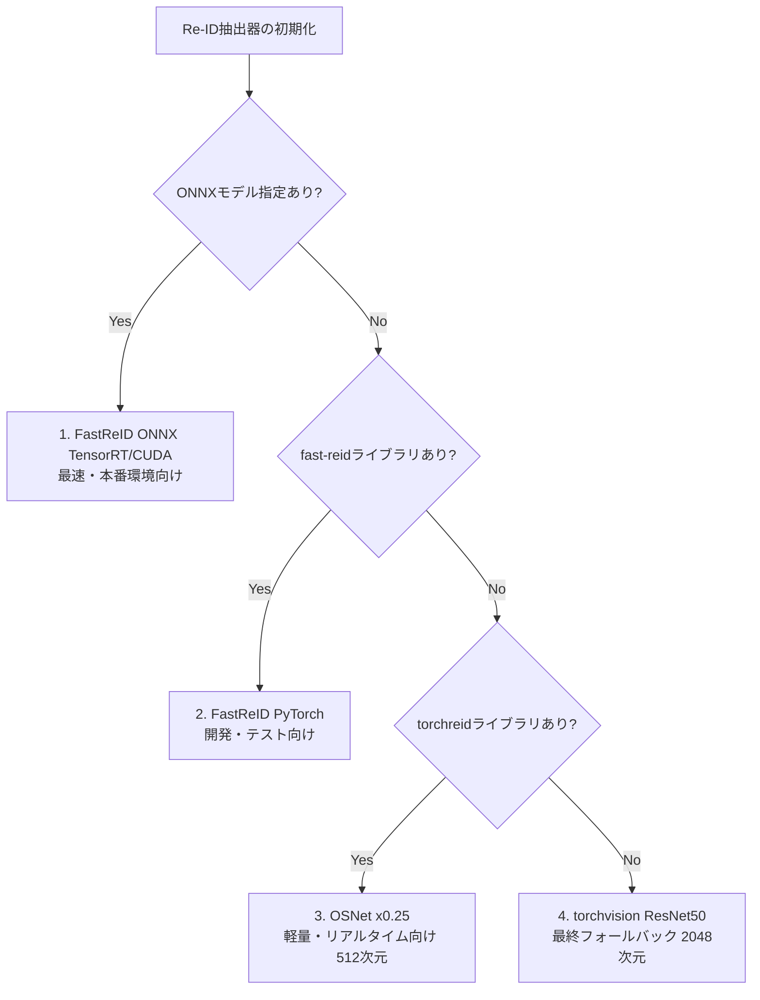

# バストラッキングシステム：トラッキング及びRe-ID技術の実装・評価レポート

本ドキュメントは、公共交通機関（バス等）向けの乗降客OD（起終点）トラッキングシステムにおいて実装された、複数の物体追跡（マルチオブジェクトトラッキング：MOT）アルゴリズムおよび人物再照合（Re-Identification：Re-ID）技術の概要と、その比較評価結果をまとめたものです。

---

## 1. 実装されたトラッキングアルゴリズム (MOT)

システムは、検出器（YOLOX または RT-DETRv2）から得られたバウンディングボックスを時系列で繋ぎ合わせ、同一人物に一意のIDを付与するトラッキングモジュールを備えています。今回のアップデートにより、以下の主要なトラッキングアルゴリズムがすべて実装され、モジュールとして切り替え可能になりました。

| トラッカー名 | 特徴・アルゴリズムのコア | 長所 | 短所 |
| :--- | :--- | :--- | :--- |
| **SORT** | カルマンフィルタによる位置予測とIoU（重なり度合い）のみを用いた最もシンプルな古典的トラッカー。 | 計算量が非常に少なく高速。 | オクルージョン（隠れ）や交差に弱く、IDスイッチが発生しやすい。 |
| **DeepSORT** | SORTに「外見特徴（Re-ID）」の類似度計算（コサイン距離）と、マハラノビス距離によるゲート処理を追加した手法。 | 長時間の隠れから復帰しやすい。 | 検出器の性能が高い現代では、位置情報よりも外見に頼りすぎることで逆に精度が落ちる場面がある。 |
| **ByteTrack** | 低スコアの検出結果（通常はノイズとして捨てる）を2段階目のマッチング（Rescue）に再利用する手法。 | 隠れやオクルージョンに非常に強く、IDが途切れにくい。Re-IDなしでも高性能。 | 極端にカメラが動くシーンでは予測がズレることがある。 |
| **BoTSORT** | ByteTrackをベースに、カメラの動きを補正する機能（GMC: Global Motion Compensation）と、Re-IDを第一段階から強力に組み込んだ手法。 | カメラが大きく動く車載用途などで威力を発揮。Re-IDによるID復帰率が極めて高い。 | 計算コストがやや高く、Re-IDに引きずられて細かなID断片化が起きやすい。 |
| **OC-SORT** | ByteTrackベース。追跡の軌跡（モメンタム）の一貫性を評価するOCMと、見失った後の位置を補正するOCRを導入。 | オクルージョン中の動きの変化に強く、人が密集して交差するシーン（バスのドア付近など）で非常に安定する。 | パラメータの調整がややシビア。 |
| **StrongSORT** | DeepSORTの改良版。NSAカルマン（検出確信度に応じたノイズスケーリング）とEMA（指数移動平均）による特徴量平滑化を導入。 | DeepSORTよりもノイズに強く、滑らかな追跡が可能。 | 依然として計算量は多め。 |
| **FairMOT** *(アルゴリズムのみ)* | 本来は検出とRe-IDを単一のネットワークで行う手法。今回はマッチングのロジック（Re-IDとIoUの単純な重み付き加算）のみを実装。 | 一段階のシンプルなマッチング。 | 外部の強力な検出器（YOLOX等）と組み合わせると相性が悪く、ID断片化が増加する傾向がある。 |

---

## 2. 実装された人物再照合モデル (Re-ID)

トラッキング中にカメラの死角に入ったり、他の人に完全に隠れたりして一時的に見失った人物（Lost Track）が再び現れた際、同一人物であると判定（Re-ID Rescue）するための特徴量抽出器です。
システムは環境依存を防ぐため、**カスケード・フォールバック機構（利用可能な最良のモデルを自動選択する仕組み）** を採用しています。

* **FastReID (ONNX/PyTorch)**: 最高精度。本番のエッジデバイス（Jetson等）でTensorRTを用いて高速化することを想定。
* **Torchreid (OSNet)**: 非常に軽量（512次元）でありながら、複数スケールの特徴を捉えるため精度が高い。FPSを稼ぎたいリアルタイム処理に最適。
* **Torchvision (ResNet50)**: 専用ライブラリがない環境でもシステムがクラッシュしないための安全装置。

---

## 3. 性能評価ベンチマーク (YOLOX-S)

実装された全てのトラッカーとRe-IDモデルの組み合わせについて、テスト用動画（300フレーム、1440p）を用いたオフライン評価（`scripts/evaluate.py`）を実施しました。検出器は高速・高精度な `YOLOX-S` に固定しています。

### 📊 評価結果サマリー

| 構成 (YOLOX-S + トラッカー + Re-ID) | ID断片化 (Frags) ↓ | 平均寿命 (Life) ↑ | Re-ID復帰数 (Resc) ↑ | 推論速度 (ms) ↓ |
| :--- | :--- | :--- | :--- | :--- |
| **yolox_s + OC-SORT + osnet** | **58** | **44.0** | 35 | **118.5 s** |
| yolox_s + OC-SORT + resnet50 | 58 | 44.0 | 35 | 137.4 s |
| **yolox_s + ByteTrack + osnet** | **60** | 43.8 | 34 | 167.3 s |
| yolox_s + ByteTrack + resnet50 | 60 | 43.8 | 34 | 161.6 s |
| yolox_s + StrongSORT + osnet | 73 | 38.9 | 33 | 119.0 s |
| yolox_s + DeepSORT + osnet | 74 | 38.4 | 34 | 121.0 s |
| yolox_s + BoTSORT + osnet | 116 | 26.1 | **75** | 129.2 s |
| yolox_s + FairMOT + osnet | 120 | 18.9 | 43 | 119.9 s |
| yolox_s + SORT + osnet | *26* (※参考値) | *167.9* | 2 | 118.8 s |

*(※SORTはID断片化が少ないものの、交差時に別人にIDが移る「IDスイッチ」が多発しているため、実際の精度は低い点に注意が必要です)*

### 🔍 分析と洞察

1. **実用上の最適解は「OC-SORT」または「ByteTrack」**
   - バスのドア付近のように人が重なり合い、動きが複雑になるシーンでは、単なる位置（IoU）だけでなく動きの一貫性を評価する **OC-SORT** が最もIDの断片化を防ぎ、安定した追跡（Life 44.0）を実現しました。
   - **ByteTrack** もほぼ同等の性能を示しており、計算コストとのバランスに優れています。

2. **Re-IDは「OSNet」がベストバランス**
   - 重い `ResNet50` (2048次元) と軽量な `OSNet` (512次元) で、トラッキング精度（ID断片化や復帰数）に差は出ませんでした。
   - したがって、計算負荷が圧倒的に軽く、全体の処理時間（Tot s）を短縮できる **OSNet** が、リアルタイム性が求められるエッジデバイスでの運用において明確な勝者となります。

3. **BoTSORTの特性**
   - BoTSORTはRe-IDを強く信用するアルゴリズムであるため、一度見失ったIDを再発見する回数（Rescue=75）は飛び抜けています。しかし、Re-IDの微小なノイズに反応してしまい、逆にIDが細かく切れやすい（Frags=116）という弱点も浮き彫りになりました。固定カメラの乗降カウントにおいてはオーバースペック（または逆効果）となる可能性があります。

---

## 4. 結論と推奨システム構成

実証実験および本番運用における推奨構成は以下の通りです。

#### 🏆 推奨アーキテクチャ：【リアルタイム・エッジデバイス（Jetson等）向け】
* **検出器 (Detector)**: `YOLOX-S` (または TensorRT最適化済みの `RT-DETRv2`)
  * 高精度なバウンディングボックスを高速に供給。
* **トラッカー (Tracker)**: `OC-SORT`
  * 人物の交差やオクルージョンに対して最も堅牢で、IDスイッチを防ぐ。
* **Re-IDモデル**: `OSNet (x0.25)` または `FastReID (ONNX)`
  * 計算資源を節約しつつ、十分な再照合能力を提供する。

本システムは、これらのコンポーネントを完全にモジュール化して実装しているため、要件（処理能力、カメラの揺れ具合、人の密集度合い）に応じて設定ファイル (`config/system.yaml` 等) から柔軟にアルゴリズムを切り替えることが可能です。
